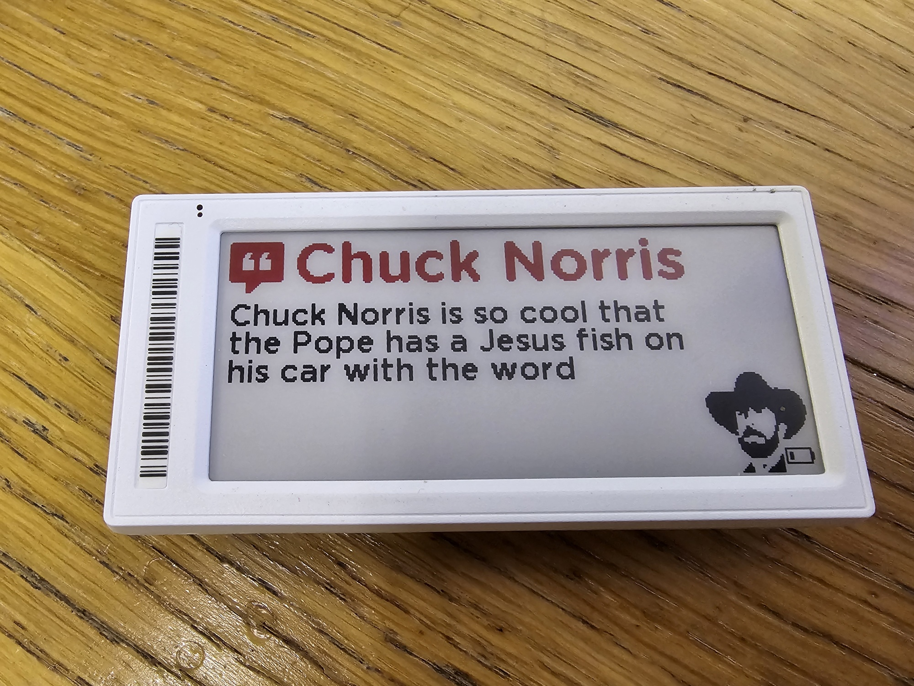
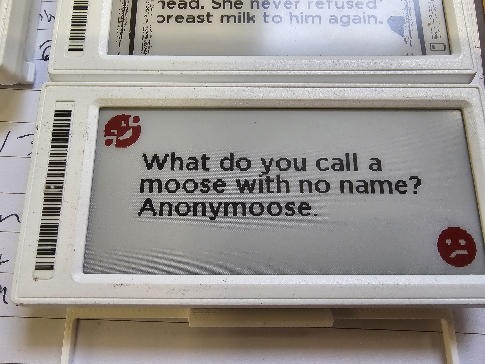
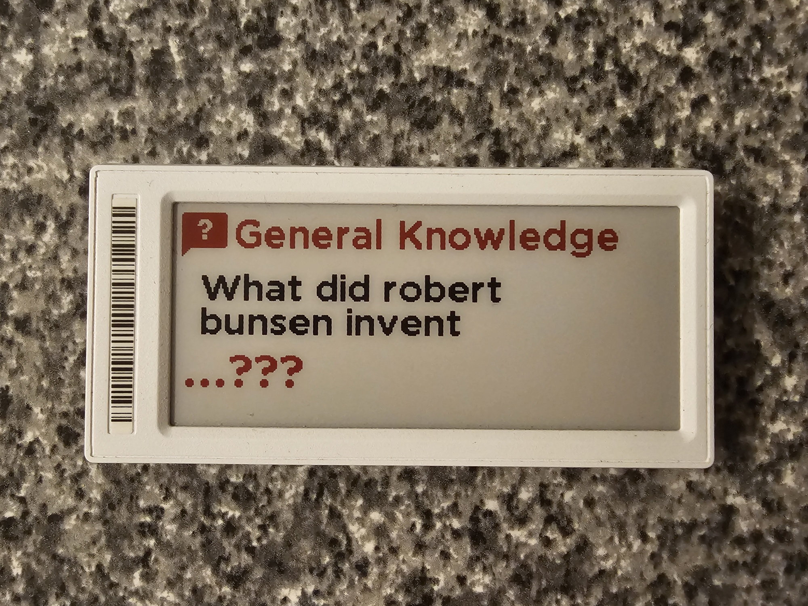

# OpenEPaperLink-HA-API-Ninja-Tags
A few examples of getting quotes, jokes, trivia from API Ninjas, using their REST API and a little JSON.

## Chuck Norris Quotes/Jokes/Facts

Show an awesome Chunk Norris quote, joke, fact (mostly true!), every hour!

## Dad Jokes

Show a (not)funny 'dad' joke, every hour!

## Trivia Questions and Answers

Show a trivia question every hour, with the answer only being revealed after 30 minutes! The answer only reveals on the second half hour of every question.... you have 30 minutes to guess on the hour before the tag updates! (Bunsen Burner btw!)

## Sensors/Integrations needed:

* https://github.com/jonasniesner/open_epaper_link_homeassistant (Install via HACS)
* An account with API Ninjas - https://api-ninjas.com/register, it's free! Once signed up, get your API key and replace `X-Api-Key: 'YOUR_SECRET_KEY_FROM_API_NINJAS'` in `ha-configuration.yaml` with your key. Or if you are smart - add it to your !secrets file.

Home Assistant and a working [OpenEpaper](https://openepaperlink.de/) setup, with HA Integration - https://github.com/jonasniesner/open_epaper_link_homeassistant

You can run all three, these are just three examples from API Ninja, of which there are dozens of free JSON databases of facts, info, jokes, trivia, riddles - use these as examples and make your own!

## Installation
* Add font `GothamRnd-Bold.ttf` to `/config/media` Home Assistant (create the folder "media" too if it's not there.).
* Add `chuck-icon.jpg` to your `/www` folder. This will allow it to be visible to the automation to download the image for the Chuck Norris tag - replace `url: https://YOUR_HA_HOSTNAME_OR_IP/local/chuck-icon.jpg` in the chuck-norris automation with your Home Assistant host name or IP URL.
* Add rest sensor `ha-configuration.yaml` to your configuration file in Home Assistant.
* Add contents of `automation-2.9-dad-jokes.yaml`, `automation-2.9-chuck-norris.yaml`, `automation-2.9-trivia.yaml`, to a new automation in Home Assistant (Choose "Edit in Yaml" from top right three dots in a new automation).

## Customizing
### Timing/API Use
The free account for API Ninjas allows for 10,000 API calls a month. I've set the sensors to get a new response every 3600 seconds (1 hour). 3x sensors, 24 hours, 30(ish) days a month gives you 2,160 API calls a month - well within your limit. Feel free to adjust the `scan_interval: 3600` up or down in the sensor config, and then adjust your automation trigger times accordingly.

### Trivia Question Reveal
The Trivia question will show for 30 minutes, and then the answer will show for the remaining 30 minutes of the hour. This is based off the trigger set to every 30 minutes of every hour (so twice). The template in the automation checks it the current time minutes is over 30, and will show the answer. If you want to show the answer all the time, remove this logic check - but where's the fun in that?!

